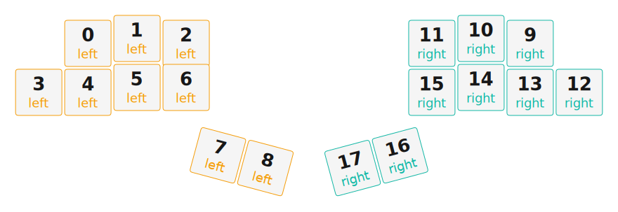

# ZMK Configuration for Alpaca Keyboard

*Generated by Shield Wizard for ZMK*

Download compiled firmware from the [Actions tab](https://github.com/arrietager/alpaca-zmk-config/actions).
[How to install firmware](https://zmk.dev/docs/user-setup#installing-the-firmware)

Edit your keymap [check here](https://zmk.dev/docs/keymaps).
User keymap is located at [`config/alpaca.keymap`](config/alpaca.keymap).

